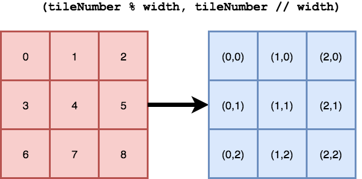
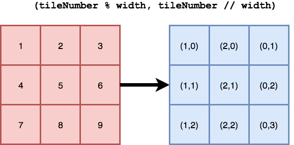

# Converting a list of tiles to tile positions

It's common to store map data as a [flat list of tiles]. As long as you know
the width of the map, you can calculate the position of each tile using the
following formula:

If you divide a tile's position in the flat list by the width, then:

* The X position (in tiles) is the remainder
* The Y position (in tiles) is the whole number quotient

For example, figuring out the coordinates of the 13th tile in a map that is 5
tiles wide:

Divide the position (13) by the width (5) and you get `2 remainder 3`. Per the
formula above, that means the 13th tile should be at position `(3,2)`.

_Some programming languages allow you to do [both of these operations at once]
while others require you to do the integer division and remainder calculations
separately._

[both of these operations at once]: https://hackage.haskell.org/package/base-4.11.0.0/docs/Prelude.html#v:divMod
[flat list of tiles]: http://docs.mapeditor.org/en/latest/reference/json-map-format/#tile-layer-example

## Zero-base vs one-base

Note that it's important to use a _zero-based position_ for elements in the flat
list. Otherwise, this throws off your coordinates because the top-left corner
becomes `(1, 0)` and your Y values increment at the end of the row rather than
at the beginning.

